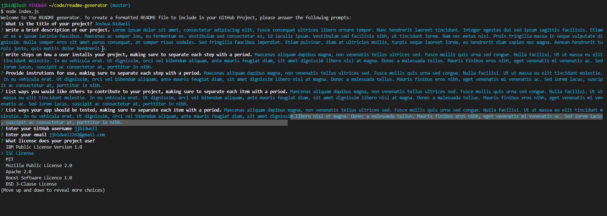
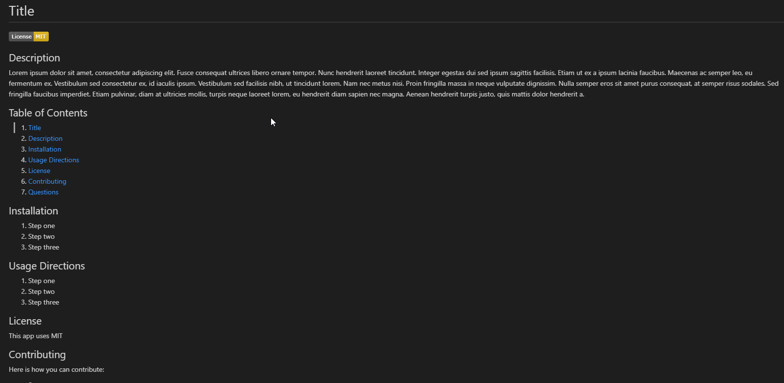

# Readme Generator

## Description
--------------------------------------------

This is a comand-line driven README generator that I have made entirely with JavaScript. The Program runs using Node.js in the command line. The app uses the Node package Inquirer to gather information from the user, and uses that information to populate a markdown file that a user can use as a README file for any project.  

The generated README will have a prominent title, description, table of content that will link to the parts of the document when clicked on, installation, usage, and contribution andd, license information, and a question section. The README will also have a license badge that will display beneath the title, and will serve as a link to the license information. 

The README will also have links to both the user's GitHub profile and an email link.

The program also breaks down sections with multiple steps or options into a list using periods inputted by the user.

## Links
-------------------------------------------

Github repository: https://github.com/jjbidwell/readme-generator  
Video instruction: https://drive.google.com/file/d/1js8tgiBhtcen4_HBqlkrsMb1AULOtZAw/view?usp=sharing

## Screenshots  
--------------------------------------------
### Console:  

### Generated README:  

